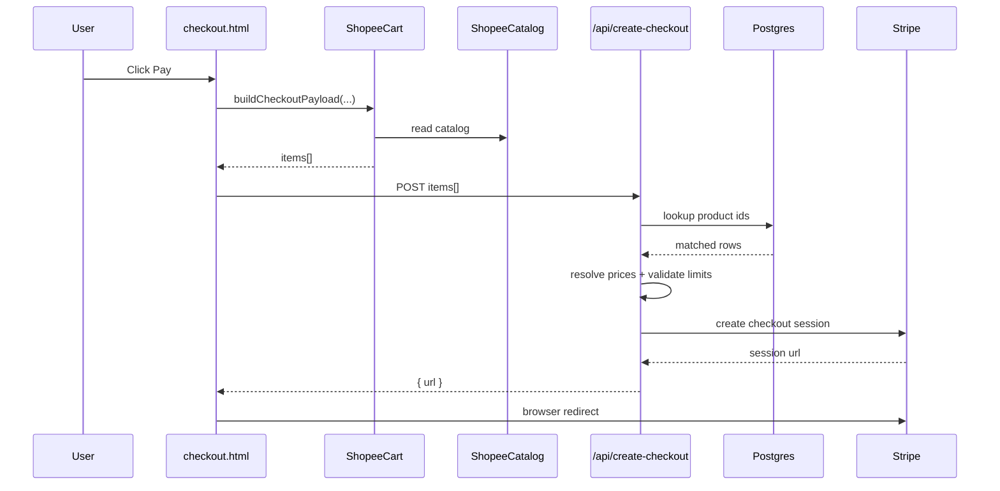
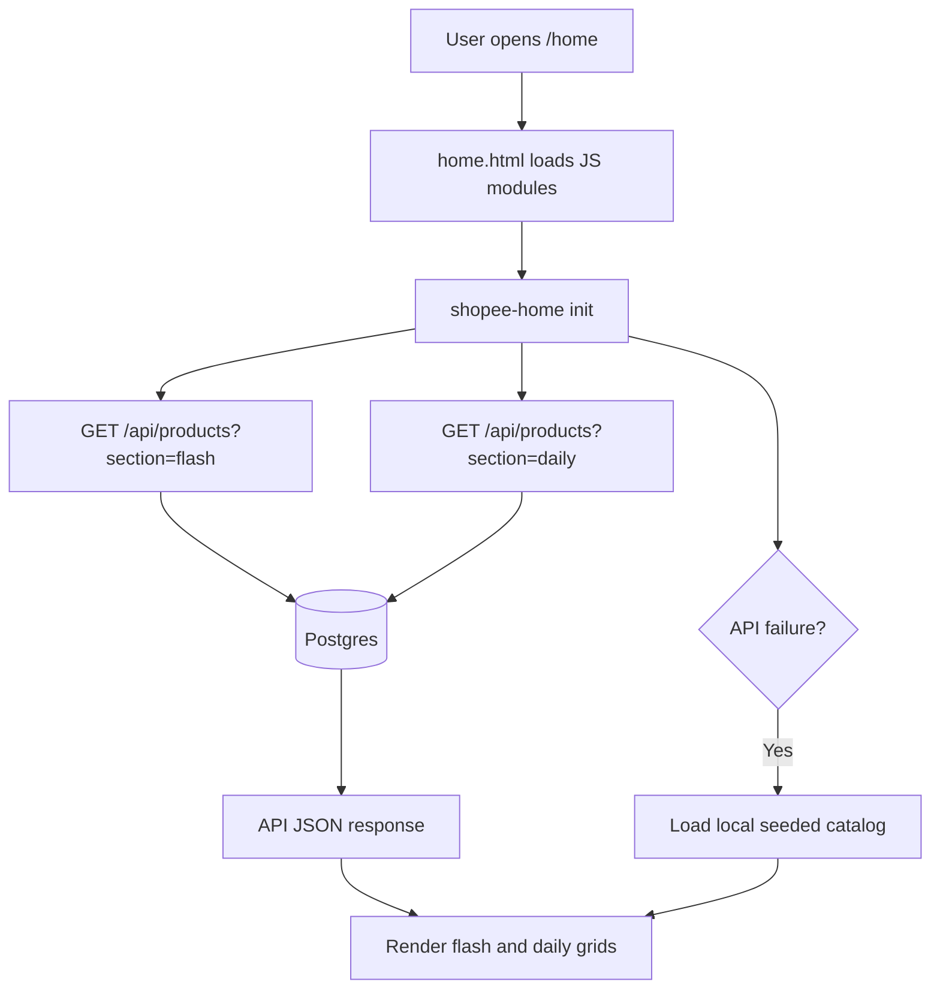
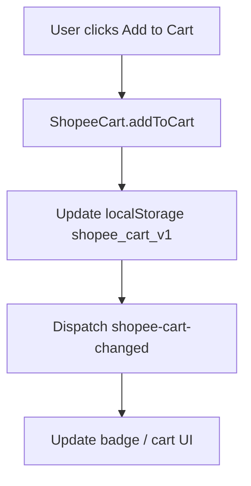
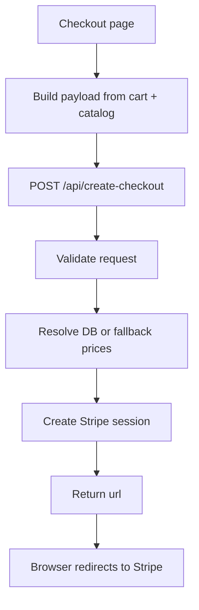

# Demo Shopping — Technical & Architecture Design

## Table of Contents

- Project Overview
- High-Level Architecture
- Technology Stack
- System Components
- Data Architecture
- Authentication & Authorization
- API Design
- Frontend Architecture
- State Management
- Payment Flow
- Rendering Strategy
- File & Directory Structure
- Environment Configuration
- Testing Architecture
- Data Flow Diagrams
- Security Design
- Performance Design
- Known Limitations & Future Work

## 1. Project Overview

`storetma-test` is a lightweight full-stack shopping demo inspired by Shopee UI and user interaction patterns. The project is intentionally simple and demo-oriented, but it still covers the key flows of a storefront:

- browse products
- filter/search/sort products
- add items to a client-side shopping cart
- review cart contents
- create a Stripe Checkout session
- redirect users to Stripe for payment
- support bilingual UI (Vietnamese / English)

Unlike a large enterprise commerce platform, this project does not currently implement true account-based order history, role-based authorization, or persistent order storage. It is closer to a storefront prototype with a server-backed catalog and server-controlled checkout.

### Core User Journeys

| Journey | Entry Point | Exit Point |
|---|---|---|
| Browse products | `/home` | Add item to cart from product grid |
| Sign in / sign out (demo UI) | `/login` | Local user state shown in header |
| Checkout | `/cart` or `/checkout` | Redirect to Stripe Checkout |
| Infinite product discovery | Daily Discover section | Paginated `/api/products` responses |
| Fallback product browsing | `/home` when API/DB fails | Render from local seeded catalog |

## 2. High-Level Architecture

```text
┌────────────────────────────────────────────────────────────────────┐
│                         Browser (Client)                           │
│                                                                    │
│  Static HTML Pages + Vanilla JS Modules                            │
│  Cart State (localStorage)    Demo User State (localStorage)       │
│  i18n Module                  Catalog Fallback Module              │
└───────────────────────────────┬────────────────────────────────────┘
                                │ HTTP / JSON
                                ▼
┌────────────────────────────────────────────────────────────────────┐
│                  Next.js 15 Serverless Runtime                     │
│                                                                    │
│  Pages API Routes                                                  │
│  - GET /api/products                                               │
│  - POST /api/create-checkout                                       │
│                                                                    │
│  DB Adapter: pages/api/_db.js                                      │
└───────────────┬──────────────────────────────┬─────────────────────┘
                │                              │
                ▼                              ▼
        ┌───────────────┐              ┌─────────────────┐
        │ Postgres/Neon │              │ Stripe API      │
        │ products table│              │ Checkout Session│
        └───────────────┘              └─────────────────┘
```

### Tier Breakdown

| Tier | Technology | Responsibility |
|---|---|---|
| Presentation | Static HTML + Tailwind CDN | Page layout, visual UI |
| Client Logic | Vanilla JS IIFE modules | Product rendering, cart behavior, i18n, demo user state |
| API | Next.js Pages API | Product querying, checkout validation, Stripe session creation |
| Data | Postgres / Neon | Product persistence |
| Payments | Stripe Checkout | Hosted payment processing |
| Testing | Vitest | Unit tests for APIs and DB adapter |

## 3. Technology Stack

### Runtime & Framework

| Package | Version | Role |
|---|---|---|
| `next` | `^15.5.0` | Full-stack framework, API routes, rewrites |
| `react` | `^18.3.1` | Framework dependency for Next.js |
| `react-dom` | `^18.3.1` | Framework dependency for Next.js |

### Backend Services

| Package | Version | Role |
|---|---|---|
| `@neondatabase/serverless` | `^1.0.2` | Serverless Postgres client |
| `@vercel/postgres` | `^0.10.0` | Present in dependencies, not primary DB path |

### Payment

| Integration | Role |
|---|---|
| Stripe Checkout REST API | Server-side checkout session creation |

### Styling

| Technology | Role |
|---|---|
| Tailwind CDN | Utility CSS on static pages |
| Google Fonts + Material Symbols | Typography and iconography |

### Testing

| Package | Version | Role |
|---|---|---|
| `vitest` | `^0.34.6` | Test runner |
| `scripts/crypto-polyfill.cjs` | local compatibility shim | Enables Vitest/Vite startup on Node 16 |

## 4. System Components

### 4.1 Routing Layer

Primary files:

- `next.config.js`
- `vercel.json`

Rewrites:

- `/` -> `/login.html`
- `/login` -> `/login.html`
- `/home` -> `/home.html`
- `/cart` -> `/cart.html`
- `/checkout` -> `/checkout.html`

Architectural note:

- Routing configuration currently exists in both `next.config.js` and `vercel.json`.
- This works for the demo, but it is a maintenance risk because the two files can drift over time.

### 4.2 API Layer

#### `pages/api/products.js`

Responsibilities:

- set CORS headers
- validate method and query parameters
- normalize section/category/search/sort/pagination
- query the `products` table
- return normalized response:
  - `items`
  - `total`
  - `hasMore`
  - `nextOffset`

#### `pages/api/create-checkout.js`

Responsibilities:

- validate request method and Stripe key
- normalize cart payload
- resolve item pricing from DB first
- fallback to known local seed prices or demo user-created products
- enforce demo-safe limits
- call Stripe Checkout API
- return `{ url }` for browser redirect

#### `pages/api/_db.js`

Responsibilities:

- create DB client using:
  - `DATABASE_URL`
  - fallback: `POSTGRES_URL`

### 4.3 Client Modules

#### `public/js/shopee-home.js`

Responsibilities:

- fetch flash products and daily products from `/api/products`
- maintain UI state for:
  - category
  - search
  - sort
  - pagination
- cache products for reuse
- update cart badge and “see more” button
- fallback to local seeded catalog when API fails

#### `public/js/shopee-cart.js`

Responsibilities:

- store cart state in localStorage key `shopee_cart_v1`
- expose cart operations:
  - get cart
  - set cart
  - add to cart
  - update quantity
  - remove line
  - clear cart
- build checkout payload from current catalog
- emit `shopee-cart-changed`

#### `public/js/shopee-catalog.js`

Responsibilities:

- provide seeded product catalog
- support locally generated demo products
- provide:
  - product display name
  - currency formatting
  - catalog inflation for demo scale

#### `public/js/shopee-user.js`

Responsibilities:

- manage demo user information in localStorage key `shopee_user`
- render guest/user header state
- support logout UI behavior

#### `public/js/shopee-i18n.js`

Responsibilities:

- maintain UI language
- translate text labels and placeholders
- support `vi` and `en`

## 5. Data Architecture

### 5.1 Primary Product Model

The backend expects a `products` table with at least these logical fields:

| Field | Type | Description |
|---|---|---|
| `id` | text | product identifier |
| `name_vi` | text | Vietnamese product name |
| `name_en` | text | English product name |
| `price_cents` | integer | price in cents |
| `image` | text | image URL |
| `section` | text | `flash` or `daily` |
| `category` | text | category value |
| `badge` | text | UI badge like `-20%` |
| `created_at` | timestamp | sort and recency support |

### 5.2 Browser-Side Data Stores

| Store | Key | Purpose |
|---|---|---|
| Cart | `shopee_cart_v1` | item IDs and quantities |
| Catalog cache | `shopee_catalog_v1` | local product cache/seed |
| Demo user | `shopee_user` | lightweight login header state |
| Language | `shopee_lang` | current UI language |

### 5.3 Data Source Hierarchy

For product browsing:

1. Postgres products table via `/api/products`
2. Local seeded catalog via `ShopeeCatalog.getCatalog()` if API fails

For checkout price resolution:

1. DB price lookup by `id`
2. hardcoded seed price map in `create-checkout.js`
3. custom product price from payload for `u_...` and `_demo_...` IDs

## 6. Authentication & Authorization

### 6.1 Current Authentication Model

This project does **not** implement real backend authentication or authorization.

What exists:

- a login page UI (`public/login.html`)
- demo user state in browser localStorage (`shopee_user`)
- header switching between guest and user mode

What does not exist:

- secure password storage
- OAuth provider integration
- JWT/session middleware
- protected routes
- role-based access control

### 6.2 Authorization Model

Current authorization is effectively:

- public browsing
- public cart usage
- public checkout initiation

No server endpoint currently checks logged-in identity.

## 7. API Design

### 7.1 GET `/api/products`

Purpose:

- retrieve flash or daily products with filtering and pagination

Query parameters:

| Param | Type | Default | Description |
|---|---|---|---|
| `section` | string | `daily` | `flash` or `daily` |
| `category` | string | `all` | category filter |
| `q` | string | `""` | keyword search |
| `sort` | string | `relevance` | `relevance`, `priceAsc`, `priceDesc`, `nameAsc` |
| `limit` | number | `12` or `24` | clamped `1..100` |
| `offset` | number | `0` | pagination offset |

Response:

```json
{
  "items": [
    {
      "id": "p1",
      "nameVi": "Ao",
      "nameEn": "Shirt",
      "price_cents": 2990,
      "image": "https://example.com/i.jpg",
      "section": "daily",
      "category": "fashion",
      "badge": "sale"
    }
  ],
  "total": 5,
  "hasMore": true,
  "nextOffset": 1
}
```

### 7.2 POST `/api/create-checkout`

Purpose:

- create a Stripe Checkout session

Request body:

```json
{
  "items": [
    {
      "id": "p1",
      "qty": 2,
      "name": "Smart Watch",
      "unit_amount_cents": 2990
    }
  ]
}
```

Response:

```json
{
  "url": "https://checkout.stripe.com/..."
}
```

Validation rules:

- request must be POST
- Stripe key must exist and begin with `sk_`
- empty cart is rejected
- quantity is clamped to `1..99`
- maximum 30 checkout lines
- maximum total amount is `5_000_000` cents

## 8. Frontend Architecture

### 8.1 Page Hierarchy

```text
/ (rewritten to login.html)
├── login.html
│   ├── language switcher
│   └── demo login form
│
├── home.html
│   ├── top navigation
│   ├── hero banner
│   ├── category navigation
│   ├── flash sale grid
│   ├── daily discover controls
│   ├── daily discover grid
│   └── floating cart badge
│
├── cart.html
│   ├── cart list
│   ├── quantity controls
│   └── checkout CTA
│
├── checkout.html
│   ├── order summary
│   ├── totals
│   └── pay button
│
└── success.html
    └── payment success feedback
```

### 8.2 Architectural Style

The frontend uses:

- static HTML pages for layout
- browser-side IIFE modules for behavior
- global browser objects for inter-module interaction:
  - `ShopeeCart`
  - `ShopeeCatalog`
  - `ShopeeI18n`
  - `ShopeeUser`

This keeps the implementation lightweight, but it also means the codebase is less structured than a typed component architecture.

## 9. State Management

### 9.1 Cart State

Storage:

- `localStorage["shopee_cart_v1"]`

Shape:

```js
[
  { id: "p1", qty: 2 },
  { id: "p7", qty: 1 }
]
```

Lifecycle:

1. User clicks “Add to Cart”
2. `ShopeeCart.addToCart()` updates localStorage
3. `shopee-cart-changed` is dispatched
4. header/cart/checkout UI refreshes

### 9.2 User State

Storage:

- `localStorage["shopee_user"]`

Usage:

- guest/user header rendering only
- not used by API authorization

### 9.3 Page State in `shopee-home.js`

Key client state variables:

- `dailyOffset`
- `dailyHasMore`
- `currentCategory`
- `dailySearchTerm`
- `dailySortMode`
- `flashRequestToken`
- `dailyRequestToken`
- `productCache`

## 10. Payment Flow

### 10.1 Full Checkout Sequence



### 10.2 Checkout Design Notes

- card data is never collected by the app itself
- Stripe is used as a hosted payment page
- checkout is possible even without real authentication
- no order persistence happens after redirect today

## 11. Rendering Strategy

### Current Strategy

| Page/Area | Strategy | Reason |
|---|---|---|
| `public/*.html` pages | static HTML | simple deployment and fast first paint |
| Product grids | client rendering after fetch | dynamic filtering/pagination |
| Cart | client-side render from localStorage | no server cart persistence |
| Checkout summary | client-side render from localStorage/catalog | keeps flow simple |
| API routes | per-request serverless execution | live DB and Stripe access |

### Fallback Strategy

- If `/api/products` fails, `home.html` falls back to the local seeded catalog
- This provides better demo resilience but can create temporary divergence from DB-backed data

## 12. File & Directory Structure

```text
storetma_test/
├── Architecture.md
├── next.config.js
├── vercel.json
├── package.json
├── package-lock.json
├── scripts/
│   └── crypto-polyfill.cjs
├── pages/
│   └── api/
│       ├── _db.js
│       ├── products.js
│       └── create-checkout.js
├── public/
│   ├── login.html
│   ├── home.html
│   ├── cart.html
│   ├── checkout.html
│   ├── success.html
│   └── js/
│       ├── shopee-home.js
│       ├── shopee-cart.js
│       ├── shopee-catalog.js
│       ├── shopee-i18n.js
│       └── shopee-user.js
├── unittest/
│   ├── _db.test.js
│   ├── api/
│   │   ├── products.test.js
│   │   └── create-checkout.test.js
│   └── helpers/
│       └── mock-http.js
└── docs/
    ├── basic-design.md
    ├── detailed-design.md
    └── setup-a-to-z.md
```

## 13. Environment Configuration

Required environment variables:

| Variable | Description | Scope |
|---|---|---|
| `DATABASE_URL` | primary DB connection string | server-only |
| `POSTGRES_URL` | fallback DB connection string | server-only |
| `STRIPE_SECRET_KEY` | Stripe secret key (`sk_...`) | server-only |

Notes:

- `pages/api/_db.js` uses `DATABASE_URL || POSTGRES_URL`
- `create-checkout.js` rejects missing or invalid Stripe secret keys

## 14. Testing Architecture

### Test Stack

- Vitest
- Node test environment
- custom mocked req/res helpers
- mocked SQL and mocked Stripe `fetch`

### Test Layout

| Layer | Test Files |
|---|---|
| DB adapter | `unittest/_db.test.js` |
| Product API | `unittest/api/products.test.js` |
| Checkout API | `unittest/api/create-checkout.test.js` |
| HTTP mocks | `unittest/helpers/mock-http.js` |

### Compatibility Design

Because local environments may still run Node 16, test startup preloads:

- `scripts/crypto-polyfill.cjs`

This ensures Vite/Vitest startup does not fail on missing `crypto.getRandomValues`.

## 15. Data Flow Diagrams

### 15.1 Homepage Load



### 15.2 Add to Cart



### 15.3 Checkout Flow



## 16. Security Design

### Current Security Controls

| Concern | Current Control |
|---|---|
| Secret handling | Stripe key and DB URL stay server-side |
| Payment handling | Stripe hosted checkout prevents card handling in app |
| Input validation | quantity, totals, line count, request method validated server-side |
| SQL safety | parameterized SQL for query values |

### Current Security Gaps

| Gap | Impact |
|---|---|
| Open CORS (`*`) | API can be called broadly in demo mode |
| No real authentication | no trusted user identity |
| No authorization | checkout and product access are public |
| No Stripe webhook verification | no trusted payment completion lifecycle |
| No order persistence | weak audit trail |

## 17. Performance Design

### Current Performance Characteristics

| Area | Design |
|---|---|
| Frontend delivery | static HTML from `public/` |
| Product fetch | paginated API calls with `limit` and `offset` |
| Browser responsiveness | localStorage-based cart avoids network round-trips |
| Failure resilience | local catalog fallback avoids blank home page |

### Performance Considerations

- `/api/products` performs:
  - one row query
  - one count query
- this is acceptable for demo scale, but for larger data volumes the count query can become more expensive
- browser-side filtering/sorting during fallback is lightweight today but could become costly with very large in-memory catalogs

### Suggested Optimizations

1. add DB indexes on `section`, `category`, `created_at`
2. add functional indexes for lowercased name search
3. debounce client search
4. consider cursor pagination if data size grows significantly

## 18. Known Limitations & Future Work

### Current Limitations

| Issue | Location | Impact |
|---|---|---|
| Duplicate rewrite config | `next.config.js`, `vercel.json` | config drift risk |
| No real authentication | login flow / `shopee-user.js` | demo-only identity |
| No order persistence | checkout flow | no order history or reconciliation |
| No Stripe webhook | backend | no verified payment completion |
| Open CORS | API routes | not production-tight |
| Untyped frontend modules | `public/js/*.js` | harder long-term maintenance |

### Recommended Future Work

1. add `orders` and `order_items` tables
2. add Stripe webhook processing and signature validation
3. replace demo user state with real authentication
4. consolidate routing config into one source of truth
5. migrate frontend modules to typed modules or React/TypeScript
6. add CI coverage thresholds and deployment validation checks

