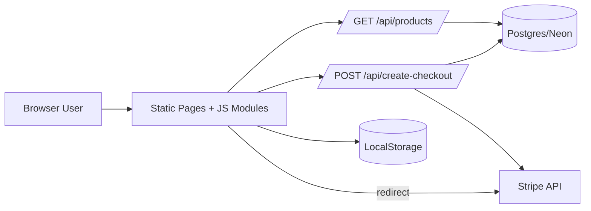

# Basic Design - StoreTMA Test

## 1. Purpose and Scope

This project is a lightweight e-commerce demo inspired by Shopee UI, focused on:

- Product discovery (Flash Sale + Daily Discover)
- Cart management
- Checkout session creation with Stripe
- Bilingual UI (Vietnamese/English)
- Deployability on Vercel with serverless APIs

Primary scope is web storefront behavior and checkout session orchestration. It is not a full OMS/WMS/PIM platform.

## 2. Stakeholders

- End users: browse catalog, add to cart, pay via Stripe
- Developers: maintain frontend + API routes
- DevOps/Platform: deploy and configure environment on Vercel
- Product/QA: validate shopping and checkout flow

## 3. High-Level Architecture

## 4. Major Components

- Frontend pages (`public/*.html`)
  - `login.html`, `home.html`, `cart.html`, `checkout.html`, `success.html`
- Frontend JS modules (`public/js/*.js`)
  - `shopee-home.js`: home rendering, filters/sort/search, API fallback
  - `shopee-cart.js`: local cart state and checkout payload builder
  - `shopee-catalog.js`: seed/demo catalog + local product helpers
  - `shopee-i18n.js`, `shopee-user.js`: language/user display behavior
- Backend API (Next.js Pages API)
  - `pages/api/products.js`: product query endpoint
  - `pages/api/create-checkout.js`: Stripe Checkout session endpoint
  - `pages/api/_db.js`: DB client factory

## 5. Functional Design (Basic)

- Product browse
  - Flash list loaded from `/api/products?section=flash`
  - Daily list loaded from `/api/products?section=daily`
  - Supports category, search (`q`), sort, pagination (`limit`, `offset`)
- Cart
  - Stored in browser `localStorage` (`shopee_cart_v1`)
  - Quantity update, remove line, total count/amount
- Checkout
  - Frontend builds payload from cart + catalog
  - Backend validates lines and amount limits
  - Backend creates Stripe Checkout session and returns redirect URL
- Fallback mode
  - If API/DB is unavailable, home page can render from local catalog seed

## 6. Data and Integration (Basic)

- Data source hierarchy
  - Primary: Postgres products table
  - Fallback: local seeded product catalog (`shopee-catalog.js`)
- External dependency
  - Stripe Checkout API (`/v1/checkout/sessions`)
- Configuration
  - `DATABASE_URL` or `POSTGRES_URL`
  - `STRIPE_SECRET_KEY`

## 7. Non-Functional Overview

- Performance: static pages + serverless APIs, low latency for demo scale
- Reliability: DB errors degrade gracefully on home page fallback
- Security:
  - Stripe secret used server-side only
  - Input clamping for quantity/amount
  - CORS currently permissive (`*`) for demo usage
- Operability:
  - Deployed on Vercel
  - Unit tests in `unittest/` using Vitest

## 8. Deployment View

- Runtime: Next.js app + static public assets
- Platform: Vercel serverless
- Routing:
  - rewrites for `/`, `/login`, `/home`, `/cart`, `/checkout` to static HTML pages
  - API routes under `/api/*`

## 9. Known Gaps (Basic)

- Open CORS policy should be tightened for production
- No authenticated user model or order persistence
- No payment webhook confirmation flow yet
- Basic logging/observability only

