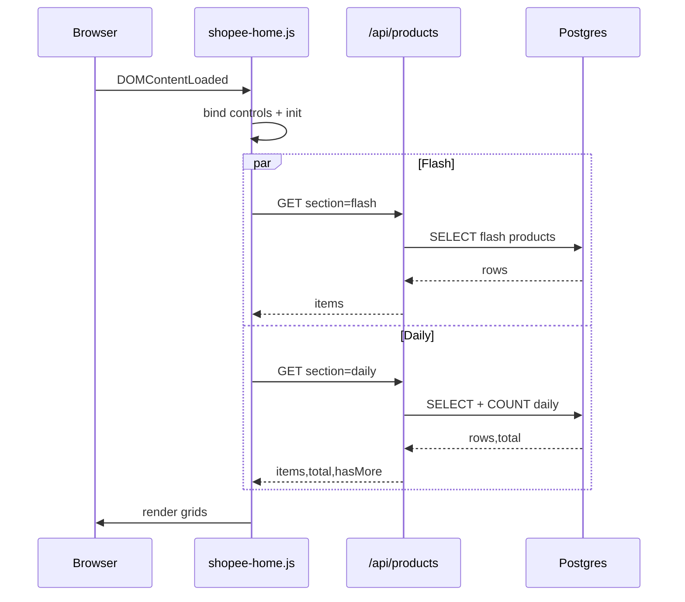
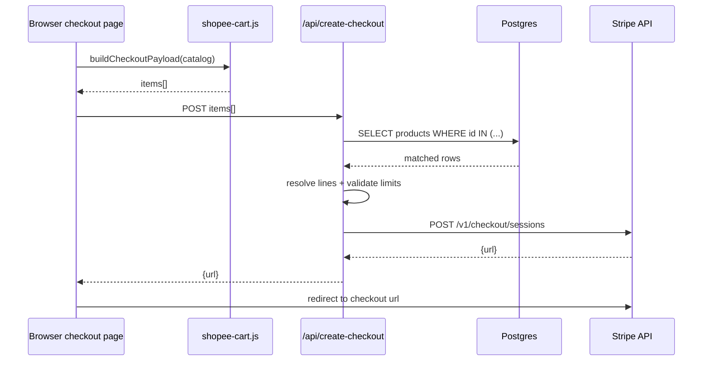

# Very Detailed Design (Developer) - StoreTMA Test

## 1. System Context and Runtime Model

### 1.1 Stack

- Framework: Next.js (Pages Router APIs + static pages in `public/`)
- Frontend runtime: vanilla JS IIFE modules
- Backend runtime: Node.js serverless functions (Vercel)
- Database client: `@neondatabase/serverless` (`neon(...)`)
- Payment integration: Stripe REST API via server-side `fetch`
- Test framework: Vitest + mocked API handler req/res

### 1.2 Runtime boundaries

- Browser-only state:
  - Cart (`localStorage` key: `shopee_cart_v1`)
  - Catalog cache/seed (`localStorage` key: `shopee_catalog_v1`)
  - Language/user UI state
- Server-only state:
  - DB credentials
  - Stripe secret key
  - Checkout session creation logic

## 2. Directory and Module Architecture

## 2.1 Structure

- `public/`
  - `home.html`, `cart.html`, `checkout.html`, `login.html`, `success.html`
  - `js/shopee-home.js`
  - `js/shopee-cart.js`
  - `js/shopee-catalog.js`
  - `js/shopee-i18n.js`
  - `js/shopee-user.js`
- `pages/api/`
  - `_db.js`
  - `products.js`
  - `create-checkout.js`
- `unittest/`
  - `_db.test.js`
  - `api/products.test.js`
  - `api/create-checkout.test.js`
  - `helpers/mock-http.js`
- `scripts/crypto-polyfill.cjs`

### 2.2 Module responsibilities

- `shopee-home.js`
  - Render flash and daily product grids
  - Handle category, search, sort, pagination/load-more
  - Call `/api/products` and maintain request tokens to avoid stale response races
  - Fallback to local catalog if API fails
- `shopee-cart.js`
  - CRUD operations on cart lines in localStorage
  - Build checkout payload from catalog + cart
  - Emit `shopee-cart-changed` custom event
- `shopee-catalog.js`
  - Seed data + deterministic demo inflation
  - Product helper APIs (name display, currency format)
  - Allow user-generated products (`u_...`)
- `products.js`
  - Query products by section/category/search/sort/pagination
  - Return normalized response contract
- `create-checkout.js`
  - Validate checkout items and values
  - Resolve pricing from DB first, fallback to seed/custom rules
  - Create Stripe Checkout URL

## 3. Data Design

## 3.1 Product record (logical model)

- `id: string`
- `name_vi: string` (or `nameVi` on frontend normalized objects)
- `name_en: string` (or `nameEn`)
- `price_cents: number`
- `image: string`
- `section: "flash" | "daily"`
- `category: enum`
- `badge: string`
- `created_at: timestamp`

### 3.2 Cart line model (browser)

- `id: string`
- `qty: number`

### 3.3 Checkout payload model

- `items: Array<{ id: string; qty: number; name?: string; unit_amount_cents?: number }>`

## 4. API Design

## 4.1 GET `/api/products`

### Query parameters

- `section`: `flash|daily` (default daily)
- `category`: allowed set or fallback to `all`
- `q`: search keyword
- `sort`: `relevance|priceAsc|priceDesc|nameAsc`
- `limit`: clamped `1..100`, default `12` for flash, `24` for daily
- `offset`: non-negative integer

### Response (200)

- `items`: normalized product array
- `total`: total matched rows
- `hasMore`: boolean
- `nextOffset`: integer

### Error behavior

- `405` on method != GET
- `500` when DB URL is missing or query fails

## 4.2 POST `/api/create-checkout`

### Request body

- `items` from cart payload

### Validation rules

- Must be POST
- `STRIPE_SECRET_KEY` must exist and start with `sk_`
- Items cannot be empty
- Quantity clamped `1..99`
- Line count max 30
- Demo total cap max `5_000_000` cents

### Pricing resolution

Priority per item:
1. DB row match by `id` (`price_cents`, `name_en`/`name_vi`)
2. Seed mapping (`KNOWN_CENTS` for `p1..p18`)
3. Custom user id pattern (`u_` or `_demo_`) with `unit_amount_cents`

### Stripe request mapping

- `mode=payment`
- `success_url={base}/success.html?session_id={CHECKOUT_SESSION_ID}`
- `cancel_url={base}/checkout.html`
- Line item array encoded as x-www-form-urlencoded

### Response behavior

- `200 { url }` on success
- `400` for invalid cart, over-limit, Stripe error payload
- `500` for internal/fetch error

## 5. Sequence Design

## 5.1 Home page loading

## 5.2 Checkout creation

## 6. Frontend Behavioral Design

## 6.1 State variables in `shopee-home.js`

- `dailyOffset`, `dailyHasMore`
- `currentCategory`, `dailySearchTerm`, `dailySortMode`
- `flashRequestToken`, `dailyRequestToken` for race-safe responses
- `productCache` to sync fallback catalog references

### 6.2 Fallback strategy

- Primary path: API data from `/api/products`
- On API fail:
  - Load from `ShopeeCatalog.getCatalog()`
  - Filter client-side by `section` + category
  - Render flash and daily from local seed/demo

### 6.3 Eventing

- Cart updates dispatch `window` custom event `shopee-cart-changed`
- Home/cart/checkout pages subscribe to refresh badge and totals

## 7. Security and Validation Design

### 7.1 Current controls

- Server-side validation for checkout quantities and totals
- Stripe key never exposed to client
- DB query parameterization for values array
- Known categories whitelist

### 7.2 Current risk areas

- CORS is `*` in APIs (suitable for demo, not strict prod)
- No auth/session for cart ownership
- No server-side persisted orders
- No webhook signature verification for payment finalization

### 7.3 Recommended hardening roadmap

1. Restrict CORS to app origin(s)
2. Add order creation + persistence before redirect
3. Add Stripe webhook endpoint with signature verification
4. Add idempotency key handling for checkout requests
5. Add rate limiting for API routes

## 8. Performance and Scalability Design

### 8.1 Current design characteristics

- Small payload API with `limit/offset`
- Separate query for rows and count in `/api/products`
- Stateless serverless functions

### 8.2 DB indexing recommendation

- Composite index for list query path:
  - `(section, category, created_at DESC)`
- Text search helpers:
  - functional indexes on `lower(name_vi)`, `lower(name_en)` if dataset grows

### 8.3 Frontend optimization opportunities

- Debounce search input
- Use cursor-based pagination for large catalogs
- Client-side cache by query key (`section/category/sort/q/offset`)

## 9. Dev/Test Design

### 9.1 Test architecture

- Unit tests focus on API handlers and DB client factory
- Dependencies mocked:
  - `getSql()` / SQL function
  - `global.fetch` for Stripe
- HTTP req/res emulation:
  - `unittest/helpers/mock-http.js`

### 9.2 Existing coverage areas

- `/api/products`
  - Method handling, CORS, validation normalization, sort SQL branch, error paths
- `/api/create-checkout`
  - Method/CORS, stripe key validation, empty/invalid cart, DB-vs-seed priority,
    limits (line count, total), stripe error and fetch failure paths
- `_db`
  - URL resolution priority and null behavior

### 9.3 CI suggestion

- Run `npm test` on each PR
- Optional: add coverage gate (`--coverage`) and minimum thresholds

## 10. Deployment and Config Design

### 10.1 Environment variables

- `DATABASE_URL` (preferred) or `POSTGRES_URL`
- `STRIPE_SECRET_KEY`

### 10.2 Routing

- Rewrites map root and friendly routes to static HTML
- API routes remain under Next.js `/api/*`
- Note: both `next.config.js` and `vercel.json` currently define rewrites/headers;
  keep one source of truth to avoid drift.

### 10.3 Runtime compatibility

- Project currently supports Node 16 runtime in local WSL via:
  - `scripts/crypto-polyfill.cjs`
  - preload in test scripts for Vitest startup compatibility

## 11. Extension Design (Developer Backlog)

### 11.1 Domain extensions

- Add `orders` table and checkout intent lifecycle
- Add `inventory` and stock validation
- Add `discount_codes` and server-side discount calculation

### 11.2 Frontend architecture evolution

- Migrate IIFE modules to typed modules (`TypeScript`)
- Introduce shared API client layer + schema validation (`zod`)
- Add componentized UI architecture (React pages or islands)

### 11.3 Operational maturity

- Structured logging with request ID correlation
- Error monitoring (Sentry or equivalent)
- Metrics dashboards for API error rate and Stripe conversion funnel

